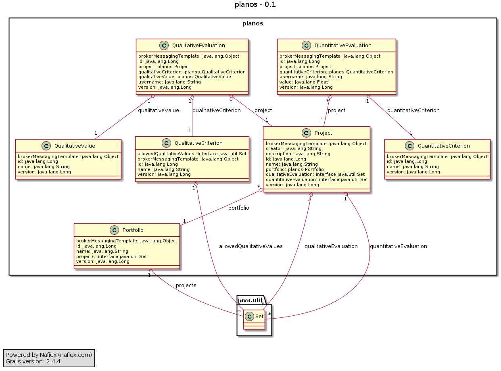

# Requirements
# Planos #
Planos is a very tool to support IT Portfolio Management decision making. This process involves evaluation of projects in 3 portfolios against 3 to 7 strategic business criteria to decide which projects to develop.

The strategic criteria can be quantitative or qualitative, and even the quantitative can usually have some sort of category ranking, such as small/medium/large. The criteria are drawn from 4 perspectives

- Financial: revenue, ROI, etc.
- Customer: measures of how the customer sees us. Timeliness, accuracy, reliability could be applicable for us.
- Internal business processes: What do we have to excel at? New product introductions, cycle time, etc.
- Learning and growth: how do we improve and innovate?

The 3 portfolios are:

- Application Portfolio: projects concerning established systems.
- Infrastructure Portfolio: essential operational components of the business
- Project Portfolio: new projects, innovative capabilities

Company leadership meets periodically, typically quarterly, to evaluate and review projects.

The purpose of this application is to simplify analysis of the project evaluation results and selection of projects to start or continue. The primary goals of this tool are:

- Provide an easy at-a-glance overview of projects, both within a portfolio and overall
- Allow each participant in the process to easily put projects within a portfolio in ranking order
- Summarize the rankings of all participants in the process for the final decision makers

Secondary goals are

- Provide a history of decisions and, through notes, the motivations behind them.
- Provide an automated first-cut at project ranking within a portfolio

This describes how it would be used

# Setup #

Elements that need setting up are:

- The strategic criteria and their type information. Quantitative measures will have a type, frequently a currency, and a numerical value. The value is typically floating point. Qualitative measures will have a set of possible values, each of which has an integer weight for calculation and graphing purposes. Strategic criteria change infrequently.
- 3 project portfolios
- Projects, which have a title, description, creator, and created/modified date.  Projects change and are frequently added to or removed from a portfolio.

# Operation #

## Evaluation ##
During evaluation, individuals evaluate each project against the strategic criteria and enter the values into Planos. No more than 10 people are invovled in evaluation, ranking and review. Several individual may provide different evaluations of the same project in the on evaluation period (e.g. the Q1 evaluation), and over time (evaluations in Q1, Q2 and Q3).

Evaluation information for each project contains

- The id of the person who did the evaluation
- Which strategic criteria is involved
- The result of the evaluation
- The date of the evaluation
- Optionally notes about the evaluation, to explain it to others.

Not all individual will evaluate all projects. 

## Ranking ##

When ranking, participants rank the projects in a portfolio according to the evaluation values. Each portfolio is ranked by itself. There is no total ordering on projects, so the ranking involves judgment and opinion. The system could perform an initial ranking based on the (possibly weighted) combination of evaluation result, combined to yield a single number, but participants would, in general, change the rankings after that. It may be useful to have some notion of equivalence, where a subset of projects are deemed to rank equally.

When each person does the ranking, he or she should not see the results of other participant’s rankings.

## Review ##

After the ranking, participants gather to review the results. Planos should combine individual ranking to provide an aggregate ranking, but it must also be possible to view the individual results that went into the aggregation.

Participants must select the projects that should proceed, and record the selection for historical purposes.

# Stories #

## Setup ##
Create portfoilos

Define strategic criteria

Create projects

## Operation ##

Person enters evaluation for a project, including notes.

Person adds to notes in evaluation.

Person changes evaluation results

## Ranking ##

Person selects portfolio, reorders projects and saves the results.

## Review ##

A person examines a portfolio and sees the projects ranked.

A person may examine how people ranked a particular project.

A person overrides the average ranking of a project, and places it in a different position.

A person designates a projects as accepted for this evaluation period.

If multiple people are looking at the project on individual machines, changes are propagated to everybody within 1 second.

A public view of the final result is available.
# This implementation

##Data model

Here is a diagram of the model

##REST + STOMP notifications

The STOMP messaging is meant to work in parallel to the REST api from which the client interacts.

So for a given resource 'portfolios', with the resource path:

    /portfolios

There is an analogous STOMP notifitcation topic:

    /topic/portfolios
    
Subscribers to this topic will receive notifications for POST, PUT and DELETE operations. The notification will have an object containing the http method, plus the ID of 
modified or created resource, eg:

    {id:123,action:"PUT"}
    

###Architecture

    -----------------------------------
    |        Client (Angularjs)       |
    |                                 |
    -----------------------------------
    |                |                |
    |    REST        |     STOMP      |
    |                |                |
    -----------------------------------
           |                  ^
           V                  |
    -----------------------------------
    |                |                |
    |  REST Service  ->   STOMP       |
    |                |                |
    -----------------------------------
    |                                 |
    |              DB (Grails)        |
    |                                 |
    -----------------------------------
    
    